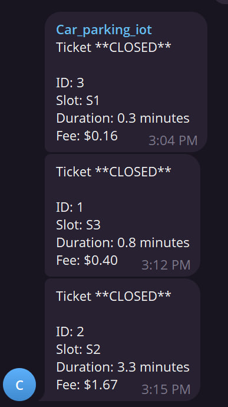

# Smart Parking Car System (ESP32)

A three-slot smart parking system built using an ESP32 microcontroller.  
The system automates vehicle entry and exit, assigns parking IDs automatically, calculates parking fees, displays real-time status on an LCD and web dashboard, and sends parking receipts via Telegram.

---

## Project Overview

This project demonstrates the use of embedded systems and IoT technologies to build an automated parking management system.  
It removes the need for manual ticketing and enables real-time monitoring and digital notifications.

Demo: https://www.youtube.com/watch?v=E6IO7oGOhrU

---

## System Features

### Entry and Gate Logic
- An ultrasonic sensor detects vehicles at the entry gate.
- If all three slots are occupied, the gate remains closed and the LCD displays `FULL`.
- If any slot is available, the LCD shows free slots (e.g., `Free: S1 S3`) and the servo gate opens.
- The gate closes automatically after the vehicle passes or after a short timeout.

---

### Auto-ID Assignment
- The system supports exactly three parking IDs: `1`, `2`, and `3`.
- When a vehicle fully occupies a slot, the lowest available ID is assigned.
- Time-in is recorded and bound to the slot.

Each slot tracks:
- Occupancy status
- Assigned ID
- Time-in timestamp

---

### Exit and Billing
- When a slot’s IR sensor detects that it has been free continuously for at least 1 second, the system confirms a vehicle exit.
- The system records time-out, calculates parking duration, computes the fee, and releases the slot and ID.

Pricing rule:
- 1 minute = $0.5

---

## LCD Display (16×2)

| System State | Display Output |
|-------------|---------------|
| Idle        | `Free: S1 S2 S3` |
| Full        | `FULL` |

---

## Web Dashboard

The ESP32 hosts a web dashboard that refreshes automatically every 2–5 seconds.

Displayed information includes:
- Total slots, free slots, and occupied slots
- Overall system status (Available or FULL)
- Individual slot status (S1–S3) with ID, time-in, and elapsed time
- Active tickets table showing currently parked vehicles
- Closed tickets table showing completed parking sessions with duration and fee

---

## Telegram Notifications

When a vehicle exits, the system sends a receipt via Telegram:

