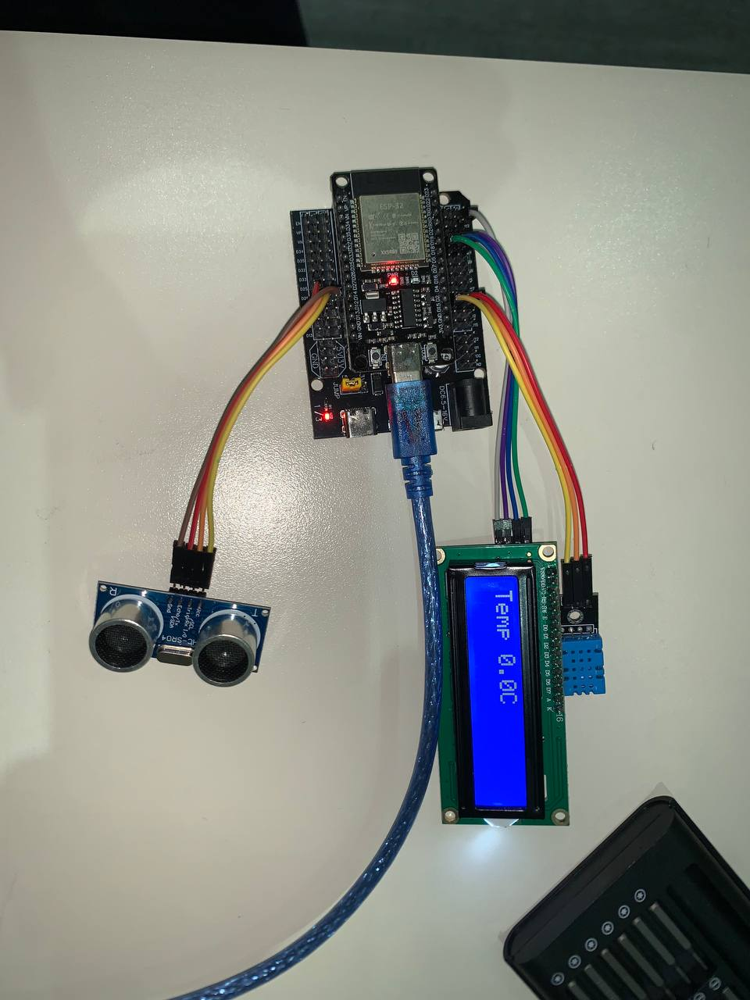
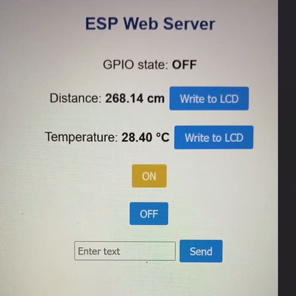
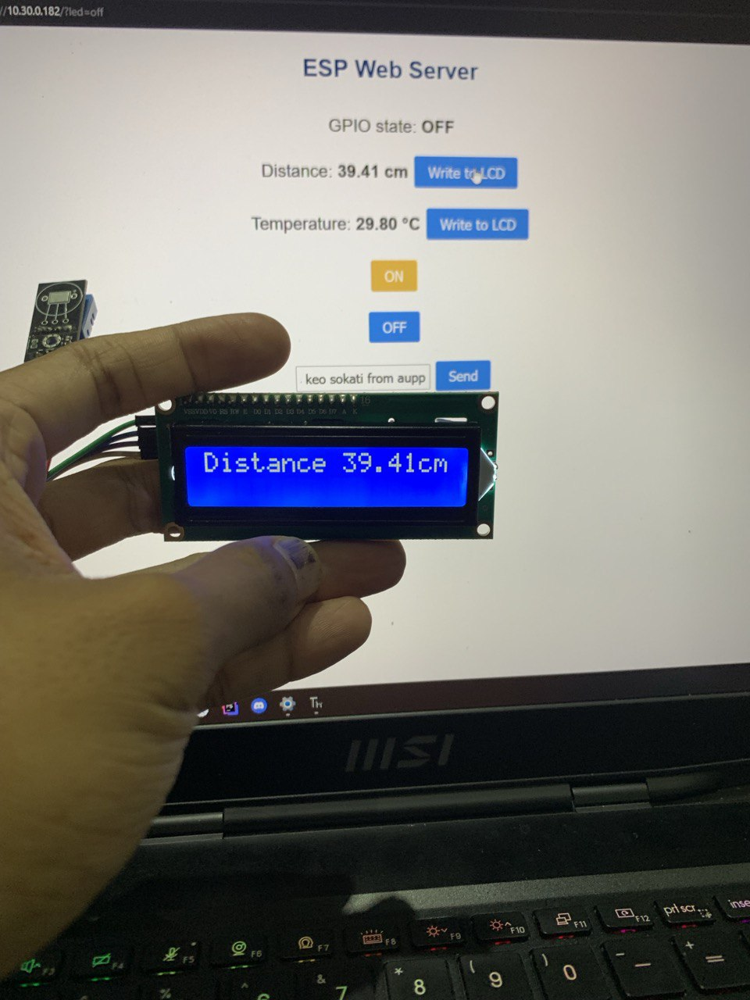
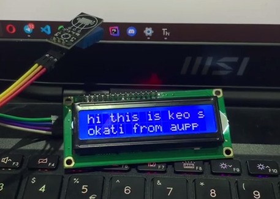

# IoT Webserver with LED, Sensors, and LCD Control

## 1. Wiring



## 2. Setup Instructions

### 2.1 Requirements

* ESP32 Dev Board (MicroPython firmware flashed)
* DHT11 sensor (temperature/humidity)
* HC-SR04 ultrasonic distance sensor
* LCD 16×2 with I²C backpack
* Breadboard, jumper wires
* USB cable + laptop with Thonny
* Wi-Fi access

### 2.2 Steps

1. Clone this repository:

   ```bash
   git clone https://github.com/SokatiKEO2/IoT02_Group5.git
   ```

2. Open **Thonny IDE** and connect ESP32 via USB.

3. Edit Wi-Fi credentials in `boot.py`:

   ```python
    ssid = 'Robotic WIFI'
    password = 'rbtWIFI@2025'

   ```

4. Upload the following files to ESP32:

   * `boot.py`
   * `main.py`
   * `lcd_api.py`
   * `machine_i2c_lcd.py`
   * `temperature.py`
   * `ultrasonic.py`

5. Run `main.py`.
   ESP32 will connect to Wi-Fi and print its IP address in the **Thonny Shell**.

6. Open a browser and go to:

   ```
   http://<esp32-ip-address>
   ```

## 3. Usage Instructions

Upon Visiting the web page you will be presented with this UI.



### 3.1 LED Control

* At the top, the On/Off state of the GPIO LED is displayed
* The `On` button will turn the GPIO LED On
* The `Off` button will turn the GPIO LED Off

### 3.2 Sensor Read

* Every 1-2 seconds readings from the sensors connected to the ESP32 will update on the webpage:
  * Temperature (°C) from DHT11
  * Distance (cm) from ultrasonic sensor
* Next to the readings a `Write to LCD` button is provided to write the readings onto the LCD attached to the ESP



### 3.3 Custom Text to LCD

At the bottom, a textbox is provided to put custom text onto the LCD.

* Enter text into the textbox and click **Send**.
* The LCD will display the message inserted to the textbox.


